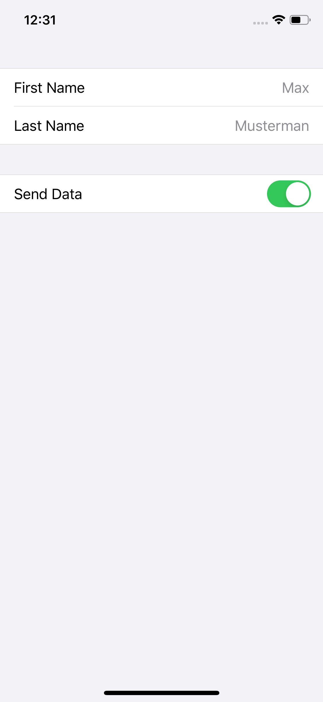

# FormViewController
This is my take on making `UITableView` useable in a more generic way but in that sense also typesafe.
Hitherto, this approach has to be seen as a prove of concept since its far from being production ready.

# Concept
This approach tries to handle the view declaration in a very `data driven` way. Therefore the actual `UITableView` implementation is completely handled and accepts an list of `Section` objects as its `data provider`. 

## Section
A `Section` includes information about its containing `header`/`footer` and its `rows`. 

### Rows

As `rows` a section accepts a list of `RowType` objects. Those in turn contain the `TableCellRow` (a base class for `UITableViewCell`s) type and a `ViewModel` object.
`TableCellRow` is defined as follows: 
```
class TableCellRow<ViewModel: RowViewModel>: UITableViewCell
```
Due to generic type constraints a `Row` only accepts a viewModel and a cell whose generic type is the same as the viewModel. The `ViewModel` contains the necessary information to display the cell

# Example



The implementation for the `FormViewController` looks like: 
```Swift
let firstNameViewModel: DetailRowViewModel = .init(title: "First Name", detail: "Max")
let firstNameRow: Row<DetailRowViewModel> = .init(cell: DetailRow.self, viewModel: firstNameViewModel)

let lastNameViewModel: DetailRowViewModel = .init(title: "Last Name", detail: "Musterman")
let lastNameRow: Row<DetailRowViewModel> = .init(cell: DetailRow.self, viewModel: lastNameViewModel)

let switchViewModel: SwitchRowViewModel = .init(title: "Send Data", isOn: true)
let switchRow: Row<SwitchRowViewModel> = .init(cell: SwitchRow.self, viewModel: switchViewModel)

let formViewCtrl: FormViewController = .init(
    withSections: [
        .init(rows: [firstNameRow, lastNameRow]),
        .init(rows: [switchRow])
    ]
)
```

## SwitchRowViewModel
```Swift
struct DetailRowViewModel: RowViewModel {
    var style: Set<TableViewCellStyle>?

    var onDisplayClosure: ((TableCellRow<DetailRowViewModel>, IndexPath) -> Void)?
    var onDidSelectClosure: ((TableCellRow<DetailRowViewModel>, IndexPath) -> Void)?

    var title: String
    var detail: String
}
```

## SwitchRow
```Swift
final class SwitchRow: TableCellRow<SwitchRowViewModel> {
    override func updateView() {
        super.updateView()

        guard let viewModel = self.viewModel else { return }
        textLabel?.text = viewModel.title

        let switchView: UISwitch = .init()
        switchView.isOn = viewModel.isOn

        addSubview(switchView)
        switchView.translatesAutoresizingMaskIntoConstraints = false
        switchView.centerYAnchor.constraint(equalTo: self.centerYAnchor).isActive = true
        switchView.trailingAnchor.constraint(equalTo: self.trailingAnchor, constant: -16.0).isActive = true
    }
}
```